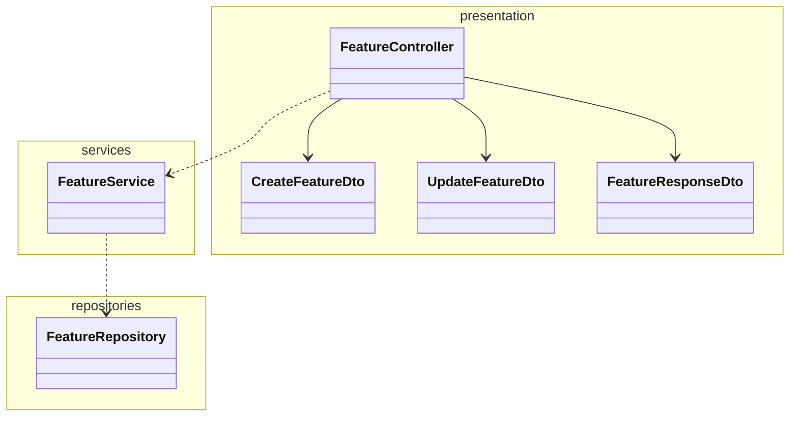

# Quacker Backend

A simplified version of Applifting's backend template for educational purposes.

## What's been set up for you

Compared to the bare bones Nest app you get when you create a new project, we also set this all up for you:

- **TypeScript Strict** mode
- **Prisma ORM**
- **Docker Compose** runs the **Postgres** database for local development
- BetterAuth-based authentication - this should allow for easy extending with e.g. social login providers
- Example database entity (**Quack**) with migrations
- Configured tests and resolve common issues with them in Nest (like proper path resolving)
- Decorator-based configuration with our `@applifting-io/nestjs-decorated-config` package
- Unit tests

## Basic feature module architecture

Just a general example on how to structure a feature module, not a strict rule.



## Decisions explanation

- PostgreSQL running in Docker Compose for consistent development and production environments
- Prisma over TypeORM as it's newer, more type safe and offers a better developer experience overall
- REST API documented via Swagger/OpenAPI (NestJS `@nestjs/swagger`)
- BetterAuth library for authentication to provide battery-included solution for registering users, logging in, email verification etc. without having to re-invent the wheel

## Database Configuration

This project uses PostgreSQL running in Docker Compose for both development and production-like environments.

1. Start the database (`pnpm dev` from the repo root does this for you):

```bash
pnpm backend docker:up
```

   It listens on host port **5433** so it can't clash with a Postgres you already run locally. Credentials for development are `quacker` / `quacker` / `quacker`.

2. Browse the data:

```bash
pnpm backend prisma:studio
```

## Running in Development

```bash
pnpm backend start:dev
```

## API Documentation

REST API (Swagger/OpenAPI) is available at http://localhost:4050/api/docs when the server is running.

# Installation

First, make sure that you provided all the necessary env variables in .env file using .env.example as a template.

```bash
$ pnpm install
```

or

```bash
$ pnpm backend docker:up # starts the Postgres container
```

### Running the app

```bash
# watch mode (you will mostly need this)
$ pnpm backend start:dev

# production mode
$ pnpm backend start:prod

# locally with docker compose (run in repo root) - will only run database for you now, you still need to run the server manually using the previous commands
$ pnpm backend docker:up

# regenerate prisma schema and reseed data after changes
$ pnpm backend seed
```

### Prisma

All Prisma commands should be run from the root directory of the project using the `pnpm backend` prefix:

```bash
# generate Prisma client and seed DB
$ pnpm backend seed
# open Prisma Studio to view/edit data
$ pnpm backend prisma:studio
```

After changing `prisma/schema.prisma` you must create and apply a migration — the seed does not do it for you:

```bash
$ pnpm backend prisma:migrations:run   # creates + applies a migration
$ pnpm backend seed                    # refill demo data
```

### Test

There is one example unit test (`src/modules/quack/services/quacks.service.spec.ts`) showing the pattern: mock the repository, test the service in isolation. CI runs it on every PR.

```bash
# unit tests
$ pnpm backend test

# test with coverage (will generate a coverage report HTML files in the coverage folder)
$ pnpm backend test:cov
```

### Better Auth

In this application, [**better-auth**](https://www.npmjs.com/package/better-auth) is utilized as the authentication module. It is designed to be easily extended with additional features or plugins, such as social login providers, multi-factor authentication, and more. Whenever database changes related to authentication are required, the following command should be run:

```bash
# propagate changes to the database schema (schema.prisma)
$ pnpm backend auth:generate
```

Hopefully you won't need to use this command and the following part, unless you want to change how the auth works/add more features to it (better ask us if you're trying to/need to for your project):

Keep in mind that there are 2 better auth configurations, one in the src/shared/auth/providers/better-auth.provider.ts (the complete config that is being used in the whole app) and one in the src/shared/auth/config/better-auth.config.ts (this config is being used by the CLI command above). You need to add the necessary changes to the better-auth config file to generate new database schema changes.


### Email Service

Emails are sent via [Resend](https://resend.com). Templates are authored as React components using [react-email](https://react.email) and live in `src/core/email/templates/`.

- `ResendAdapter` is used automatically when `RESEND_API_KEY` is set.
- If `RESEND_API_KEY` is empty (the default in `.env.example`), the `ConsoleMailerAdapter` logs emails to stdout — handy for local dev.
- The `from` address comes from `EMAIL_FROM`.

#### Authoring templates

Templates are plain `.tsx` React components receiving typed props. Use the components from `@react-email/components` to keep markup email-client safe.

Preview templates locally with the bundled react-email dev server:

```bash
pnpm backend email:dev
```

To render a template to HTML at runtime, use the `renderEmail` helper in `src/core/email/render.ts`:

```ts
const html = await renderEmail(VerifyEmail, { url });
await emailProvider.sendEmail(user.email, 'Verify your email address', html);
```
